# Better Auth Flutter Client SDK PRD

## 문서 정보

| 항목   | 내용                                                |
| ------ | --------------------------------------------------- |
| 문서명 | Better Auth Flutter Client SDK 제품 요구사항 정의서 |
| 버전   | 1.4.0                                               |
| 작성일 | 2026-01-16                                          |
| 상태   | Final                                               |

---

## 1. 개요

### 1.1 프로젝트 배경

Better Auth는 TypeScript 기반의 프레임워크 독립적인(framework-agnostic) 인증 및 권한 관리 라이브러리입니다. 현재 React, Vue, Svelte, Solid 등 웹 프레임워크용 클라이언트 SDK를 제공하고 있으나, 모바일 네이티브 환경(Flutter/Dart)을 위한 공식 SDK는 존재하지 않습니다.

Flutter는 크로스플랫폼 모바일/웹/데스크톱 개발에서 높은 점유율을 보이고 있으며, Better Auth 서버를 백엔드로 사용하는 Flutter 앱 개발자들의 수요가 증가하고 있습니다.

### 1.2 목적 및 목표

**목적:**

- Better Auth 서버와 완벽하게 호환되는 Flutter/Dart 클라이언트 SDK 개발
- TypeScript 클라이언트 SDK의 기능을 Dart 생태계에 맞게 포팅

**목표:**

- Better Auth의 모든 클라이언트 기능을 Flutter에서 사용 가능하게 함
- Dart/Flutter의 관용적 패턴(idiomatic patterns)을 따르는 API 설계
- 플러그인 시스템을 통한 확장성 제공
- 타입 안전성(Type Safety) 보장

### 1.3 범위

**포함 범위:**

- Core 인증 (이메일/비밀번호, 세션 관리)
- 소셜 로그인 (OAuth 2.0 / OpenID Connect)
- Two-Factor Authentication (2FA/TOTP)
- Magic Link (비밀번호 없는 이메일 인증)
- Passkey (WebAuthn/FIDO2)
- Organization (조직/팀 관리)
- Riverpod 상태관리 지원

**제외 범위:**

- Better Auth 서버 구현
- 데이터베이스 어댑터
- 이메일 발송 서비스

### 1.4 대상 사용자

| 사용자 유형     | 설명                                                          |
| --------------- | ------------------------------------------------------------- |
| Flutter 개발자  | Better Auth 서버를 백엔드로 사용하는 모바일/웹 앱 개발자      |
| 풀스택 개발자   | TypeScript 백엔드와 Flutter 프론트엔드를 함께 개발하는 개발자 |
| 엔터프라이즈 팀 | 조직 관리 및 복잡한 인증 요구사항이 있는 팀                   |

---

## 2. 요구사항 정의

### 2.1 기능 요구사항

#### 2.1.1 Core 인증

| ID       | 기능                     | 설명                                                  | 우선순위 |
| -------- | ------------------------ | ----------------------------------------------------- | -------- |
| CORE-001 | 이메일/비밀번호 회원가입 | signUp.email() - 이메일, 비밀번호, 이름으로 계정 생성 | P0       |
| CORE-002 | 이메일/비밀번호 로그인   | signIn.email() - 이메일, 비밀번호로 인증              | P0       |
| CORE-003 | 로그아웃                 | signOut() - 현재 세션 종료                            | P0       |
| CORE-004 | 세션 조회                | getSession() - 현재 세션 정보 조회                    | P0       |
| CORE-005 | 반응형 세션              | useSession() - 세션 상태 변화 스트림                  | P0       |
| CORE-006 | 사용자 정보 업데이트     | updateUser() - 이름, 이미지 등 정보 수정              | P1       |
| CORE-007 | 비밀번호 변경            | changePassword() - 기존 비밀번호 확인 후 변경         | P1       |
| CORE-008 | 비밀번호 찾기            | forgetPassword() - 비밀번호 재설정 이메일 발송        | P1       |
| CORE-009 | 비밀번호 재설정          | resetPassword() - 토큰으로 비밀번호 재설정            | P1       |
| CORE-010 | 이메일 인증              | verifyEmail() - 이메일 인증 처리                      | P1       |
| CORE-011 | 계정 삭제                | deleteUser() - 사용자 계정 삭제                       | P2       |
| CORE-012 | 세션 목록 조회           | listSessions() - 모든 활성 세션 조회                  | P2       |
| CORE-013 | 특정 세션 종료           | revokeSession() - 특정 세션 무효화                    | P2       |
| CORE-014 | 모든 세션 종료           | revokeSessions() - 모든 세션 무효화                   | P2       |

#### 2.1.2 소셜 로그인 (OAuth)

| ID        | 기능              | 설명                                     | 우선순위 |
| --------- | ----------------- | ---------------------------------------- | -------- |
| OAUTH-001 | 소셜 로그인       | signIn.social() - 소셜 프로바이더로 인증 | P0       |
| OAUTH-002 | Google 로그인     | provider: "google" 지원                  | P0       |
| OAUTH-003 | Apple 로그인      | provider: "apple" 지원                   | P0       |
| OAUTH-004 | GitHub 로그인     | provider: "github" 지원                  | P1       |
| OAUTH-005 | Facebook 로그인   | provider: "facebook" 지원                | P1       |
| OAUTH-006 | Discord 로그인    | provider: "discord" 지원                 | P2       |
| OAUTH-007 | Twitter 로그인    | provider: "twitter" 지원                 | P2       |
| OAUTH-008 | 커스텀 프로바이더 | 사용자 정의 OAuth 프로바이더 지원        | P2       |
| OAUTH-009 | 계정 연결         | linkSocial() - 기존 계정에 소셜 연결     | P1       |
| OAUTH-010 | 딥링크 콜백 처리  | OAuth 리다이렉트 후 앱 복귀 처리         | P0       |

#### 2.1.3 Two-Factor Authentication (2FA)

| ID      | 기능           | 설명                                      | 우선순위 |
| ------- | -------------- | ----------------------------------------- | -------- |
| 2FA-001 | 2FA 활성화     | twoFactor.enable() - TOTP 2FA 활성화      | P1       |
| 2FA-002 | 2FA 비활성화   | twoFactor.disable() - 2FA 비활성화        | P1       |
| 2FA-003 | QR 코드 생성   | twoFactor.generateTOTP() - TOTP 설정용 QR | P1       |
| 2FA-004 | TOTP 검증      | twoFactor.verifyTOTP() - 코드 검증        | P1       |
| 2FA-005 | 백업 코드 생성 | twoFactor.generateBackupCodes()           | P1       |
| 2FA-006 | 백업 코드 검증 | twoFactor.verifyBackupCode()              | P1       |
| 2FA-007 | 신뢰 디바이스  | trustDevice 옵션으로 디바이스 신뢰        | P2       |
| 2FA-008 | 2FA 상태 확인  | twoFactor.getStatus()                     | P1       |

#### 2.1.4 Magic Link

| ID        | 기능           | 설명                                           | 우선순위 |
| --------- | -------------- | ---------------------------------------------- | -------- |
| MAGIC-001 | 매직링크 발송  | signIn.magicLink() - 이메일로 로그인 링크 발송 | P1       |
| MAGIC-002 | 매직링크 검증  | 딥링크로 전달된 토큰 검증 및 세션 생성         | P1       |
| MAGIC-003 | 만료 시간 처리 | 링크 만료 시 적절한 에러 처리                  | P1       |

#### 2.1.5 Passkey (WebAuthn/FIDO2)

| ID          | 기능         | 설명                                     | 우선순위 |
| ----------- | ------------ | ---------------------------------------- | -------- |
| PASSKEY-001 | 패스키 등록  | passkey.register() - 새 패스키 등록      | P1       |
| PASSKEY-002 | 패스키 인증  | passkey.authenticate() - 패스키로 로그인 | P1       |
| PASSKEY-003 | 패스키 목록  | passkey.list() - 등록된 패스키 목록      | P2       |
| PASSKEY-004 | 패스키 삭제  | passkey.delete() - 패스키 제거           | P2       |
| PASSKEY-005 | Android 지원 | Android Credential Manager API 연동      | P1       |
| PASSKEY-006 | iOS 지원     | ASAuthorization API 연동                 | P1       |

#### 2.1.6 Organization

| ID      | 기능           | 설명                                    | 우선순위 |
| ------- | -------------- | --------------------------------------- | -------- |
| ORG-001 | 조직 생성      | organization.create()                   | P1       |
| ORG-002 | 조직 목록      | organization.list()                     | P1       |
| ORG-003 | 조직 상세      | organization.getFullOrganization()      | P1       |
| ORG-004 | 활성 조직 설정 | organization.setActive()                | P1       |
| ORG-005 | 조직 업데이트  | organization.update()                   | P1       |
| ORG-006 | 조직 삭제      | organization.delete()                   | P2       |
| ORG-007 | 멤버 초대      | organization.inviteMember()             | P1       |
| ORG-008 | 초대 수락      | organization.acceptInvitation()         | P1       |
| ORG-009 | 초대 거절      | organization.rejectInvitation()         | P2       |
| ORG-010 | 멤버 추가      | organization.addMember()                | P1       |
| ORG-011 | 멤버 제거      | organization.removeMember()             | P1       |
| ORG-012 | 멤버 역할 변경 | organization.updateMemberRole()         | P1       |
| ORG-013 | 팀 생성        | organization.createTeam()               | P2       |
| ORG-014 | 팀 관리        | organization.updateTeam(), deleteTeam() | P2       |
| ORG-015 | 팀 멤버 관리   | addTeamMember(), removeTeamMember()     | P2       |

#### 2.1.7 플러그인 시스템

| ID         | 기능                  | 설명                        | 우선순위 |
| ---------- | --------------------- | --------------------------- | -------- |
| PLUGIN-001 | 플러그인 아키텍처     | 확장 가능한 플러그인 시스템 | P0       |
| PLUGIN-002 | Core 플러그인         | 기본 인증 기능 (기본 포함)  | P0       |
| PLUGIN-003 | OAuth 플러그인        | 소셜 로그인 기능            | P0       |
| PLUGIN-004 | 2FA 플러그인          | Two-Factor 인증 기능        | P1       |
| PLUGIN-005 | Magic Link 플러그인   | 매직 링크 기능              | P1       |
| PLUGIN-006 | Passkey 플러그인      | WebAuthn/FIDO2 기능         | P1       |
| PLUGIN-007 | Organization 플러그인 | 조직 관리 기능              | P1       |
| PLUGIN-008 | 커스텀 플러그인 지원  | 사용자 정의 플러그인 등록   | P2       |

### 2.2 비기능 요구사항

#### 2.2.1 성능

| ID       | 요구사항      | 목표                     |
| -------- | ------------- | ------------------------ |
| PERF-001 | API 응답 처리 | < 100ms (네트워크 제외)  |
| PERF-002 | 세션 캐싱     | 불필요한 API 호출 최소화 |
| PERF-003 | 메모리 사용량 | 최소화된 메모리 풋프린트 |
| PERF-004 | 앱 시작 시간  | SDK 초기화 < 50ms        |

#### 2.2.2 보안

| ID      | 요구사항       | 설명                            |
| ------- | -------------- | ------------------------------- |
| SEC-001 | 토큰 보안 저장 | flutter_secure_storage 사용     |
| SEC-002 | HTTPS 강제     | 모든 API 통신 TLS 사용          |
| SEC-003 | 인증서 피닝    | 선택적 Certificate Pinning 지원 |
| SEC-004 | 메모리 보안    | 민감 데이터 메모리 노출 최소화  |
| SEC-005 | 코드 난독화    | ProGuard/R8 호환성              |

#### 2.2.3 호환성

| ID         | 요구사항           | 버전                   |
| ---------- | ------------------ | ---------------------- |
| COMPAT-001 | Flutter SDK        | >= 3.10.0              |
| COMPAT-002 | Dart SDK           | >= 3.0.0               |
| COMPAT-003 | Android            | API 21+ (Android 5.0+) |
| COMPAT-004 | iOS                | iOS 12.0+              |
| COMPAT-005 | Better Auth Server | >= 1.0.0               |

#### 2.2.4 확장성

| ID      | 요구사항             | 설명                     |
| ------- | -------------------- | ------------------------ |
| EXT-001 | 플러그인 확장        | 새 플러그인 추가 용이    |
| EXT-002 | HTTP 클라이언트 교체 | DIO/http 등 교체 가능    |
| EXT-003 | 저장소 교체          | 토큰 저장소 커스터마이징 |
| EXT-004 | 인터셉터             | 요청/응답 인터셉터 지원  |

### 2.3 기술적 제약 사항

| ID        | 제약                | 설명                                                      |
| --------- | ------------------- | --------------------------------------------------------- |
| CONST-001 | Flutter 패키지      | Core SDK는 Flutter 환경을 대상으로 함 (Dart CLI 미지원)   |
| CONST-002 | 상태관리 분리       | Riverpod 래퍼는 별도 패키지로 제공                        |
| CONST-003 | 최소 의존성         | 외부 의존성 최소화                                        |
| CONST-004 | 네이티브 브릿지     | Passkey 등 네이티브 기능은 Method Channel 사용            |
| CONST-005 | Secure Storage 필수 | 토큰 저장에 flutter_secure_storage 사용 (Platform Plugin) |

---

## 3. 아키텍처 설계

### 3.1 전체 아키텍처

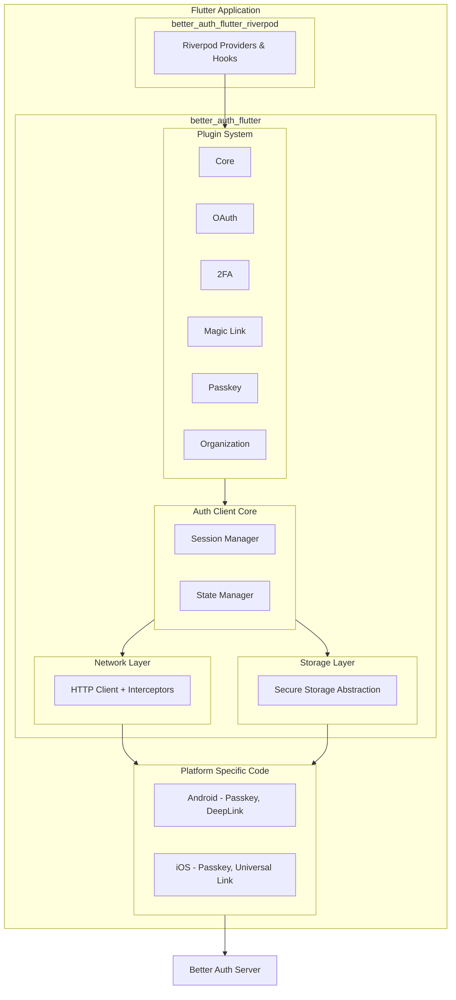

### 3.2 레이어 구조

```
lib/
├── better_auth_flutter.dart          # 메인 export
├── src/
│   ├── core/                         # Core Layer
│   │   ├── client.dart               # BetterAuthClient
│   │   ├── config.dart               # Configuration
│   │   └── exceptions.dart           # Exception 정의
│   │
│   ├── network/                      # Network Layer
│   │   ├── http_client.dart          # HTTP 클라이언트 추상화
│   │   ├── interceptors/             # 인터셉터
│   │   │   ├── auth_interceptor.dart
│   │   │   └── retry_interceptor.dart
│   │   └── api_response.dart         # 응답 래퍼
│   │
│   ├── storage/                      # Storage Layer
│   │   ├── storage_interface.dart    # 저장소 인터페이스
│   │   ├── secure_storage.dart       # Secure Storage 구현
│   │   └── memory_storage.dart       # 메모리 저장소 (테스트용)
│   │
│   ├── session/                      # Session Management
│   │   ├── session_manager.dart      # 세션 관리자
│   │   └── session_state.dart        # 세션 상태
│   │
│   ├── plugins/                      # Plugin System
│   │   ├── plugin_base.dart          # 플러그인 베이스
│   │   ├── core_plugin.dart          # Core 인증
│   │   ├── oauth_plugin.dart         # OAuth
│   │   ├── two_factor_plugin.dart    # 2FA
│   │   ├── magic_link_plugin.dart    # Magic Link
│   │   ├── passkey_plugin.dart       # Passkey
│   │   └── organization_plugin.dart  # Organization
│   │
│   ├── models/                       # Data Models
│   │   ├── user.dart
│   │   ├── session.dart
│   │   ├── organization.dart
│   │   └── ...
│   │
│   └── utils/                        # Utilities
│       ├── deep_link_handler.dart
│       └── platform_utils.dart
│
└── platform/                         # Platform Specific
    ├── android/
    └── ios/
```

### 3.3 Network Layer (HTTP Client & Interceptors)

**HTTP 클라이언트 추상화:**

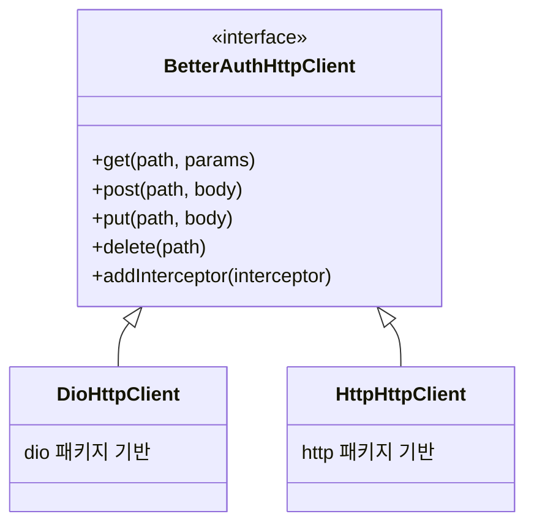

**인터셉터 체인:**

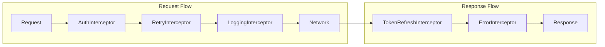

**토큰 자동 갱신 흐름:**

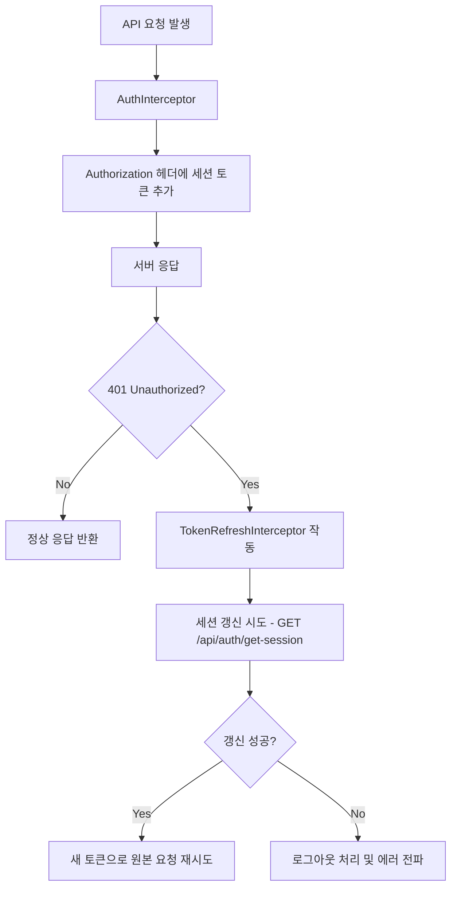

**쿠키 관리 전략:**

Better Auth 서버는 기본적으로 브라우저 쿠키(HttpOnly)에 의존합니다. 모바일 환경에서는 쿠키가 자동으로 관리되지 않으므로 별도 처리가 필요합니다.

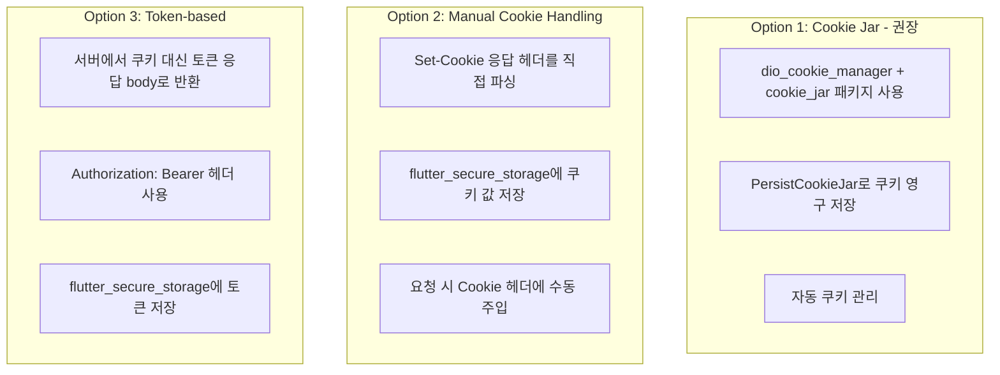

**CookieInterceptor 구현:**

| 단계         | 동작                             |
| ------------ | -------------------------------- |
| 1. 요청 전   | 저장된 쿠키를 Cookie 헤더에 추가 |
| 2. 응답 후   | Set-Cookie 헤더 파싱하여 저장    |
| 3. 만료 처리 | 만료된 쿠키 자동 삭제            |

**오프라인 처리 정책:**

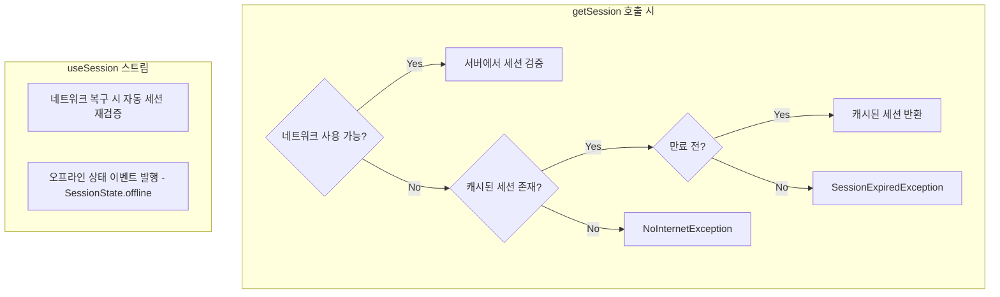

### 3.4 플러그인 시스템 설계

**플러그인 인터페이스:**

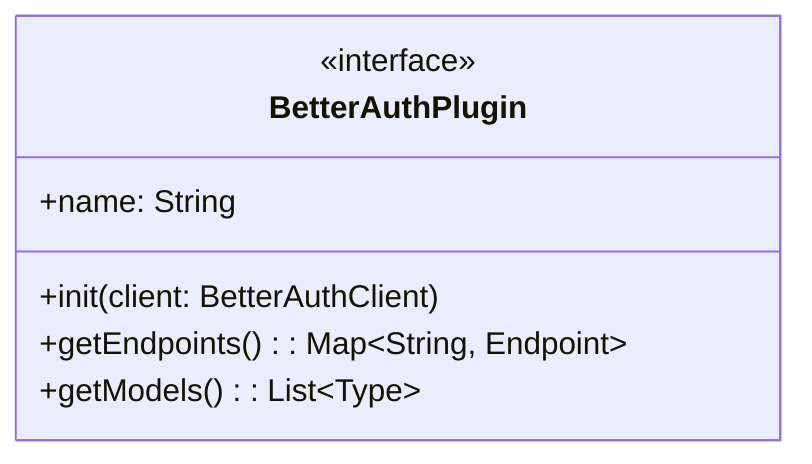

**플러그인 등록 예시:**

```dart
BetterAuthClient.create(
  baseUrl: "https://api.example.com",
  plugins: [
    CorePlugin(),        // 기본 포함
    OAuthPlugin(),
    TwoFactorPlugin(),
    OrganizationPlugin(),
  ],
)
```

**플러그인 확장 메커니즘:**

```dart
// 플러그인이 클라이언트에 메서드 추가
client.signIn.email(...)     // CorePlugin
client.signIn.social(...)    // OAuthPlugin
client.twoFactor.enable(...) // TwoFactorPlugin
client.organization.create() // OrganizationPlugin
```

### 3.5 상태 관리 전략

**Core SDK vs Riverpod Wrapper 분리:**

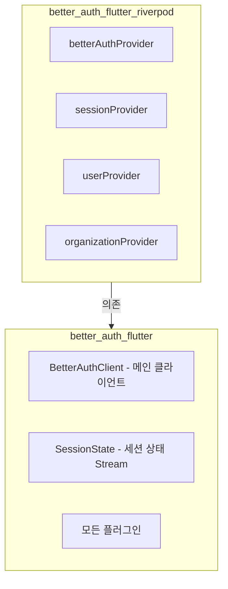

**상태 스트림 설계:**

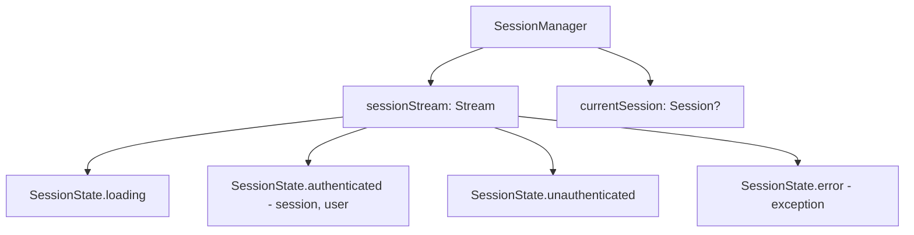

---

## 4. API 및 기능 명세

### 4.0 클라이언트 초기화 및 설정

**BetterAuthClient 생성:**

```
BetterAuthClient.create(
  baseUrl: String,                    // Better Auth 서버 URL
  plugins: List<BetterAuthPlugin>,    // 사용할 플러그인 목록
  httpClient: BetterAuthHttpClient?,  // 커스텀 HTTP 클라이언트 (선택)
  storage: TokenStorage?,             // 커스텀 토큰 저장소 (선택)
  options: ClientOptions?,            // 추가 옵션
)
```

**ClientOptions:**

```
ClientOptions(
  timeout: Duration,                  // 요청 타임아웃 (기본: 30초)
  retryCount: int,                    // 재시도 횟수 (기본: 3)
  enableLogging: bool,                // 로깅 활성화
  certificatePinning: List<String>?,  // 인증서 핀 목록
  cookieEnabled: bool,                // 쿠키 사용 여부
)
```

### 4.1 Core API

**회원가입:**

```
signUp.email(
  email: String,
  password: String,
  name: String,
  image: String?,
  callbackUrl: String?,
) → Future<AuthResponse<User>>
```

**로그인:**

```
signIn.email(
  email: String,
  password: String,
  rememberMe: bool?,
  callbackUrl: String?,
) → Future<AuthResponse<Session>>
```

**로그아웃:**

```
signOut() → Future<void>
```

**세션 조회:**

```
getSession() → Future<Session?>
useSession() → Stream<SessionState>
```

### 4.2 세션 관리 및 토큰 갱신

**세션 자동 갱신:**

```
1. 앱 시작 시 저장된 세션 토큰 로드
2. getSession() 호출하여 세션 유효성 검증
3. 세션 유효: 인증 상태로 전환
4. 세션 만료:
   - Cookie 방식: 자동 갱신 시도
   - Token 방식: 로그아웃 처리
```

**세션 이벤트:**

```
SessionEvent.signedIn(session)      // 로그인 완료
SessionEvent.signedOut              // 로그아웃 완료
SessionEvent.sessionRefreshed       // 세션 갱신됨
SessionEvent.sessionExpired         // 세션 만료됨
```

### 4.3 OAuth 및 딥링크 처리

**소셜 로그인:**

```
signIn.social(
  provider: String,           // "google", "apple", "github" 등
  callbackUrl: String?,       // 리다이렉트 URL (딥링크)
  scopes: List<String>?,      // 추가 스코프
) → Future<AuthResponse<Session>>
```

**딥링크 처리 흐름:**

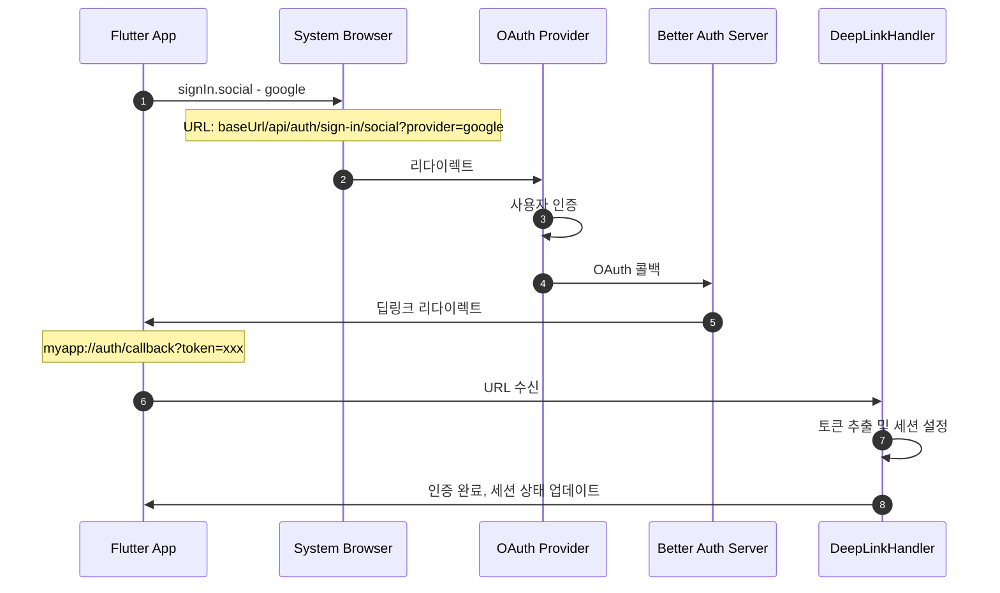

**플랫폼별 딥링크 설정:**

| 플랫폼  | 방식                   | 설정                              |
| ------- | ---------------------- | --------------------------------- |
| Android | App Links / Deep Links | AndroidManifest.xml intent-filter |
| iOS     | Universal Links        | Associated Domains entitlement    |

### 4.4 2FA API

**2FA 활성화:**

```
twoFactor.enable(
  password: String,           // 현재 비밀번호 확인
) → Future<TwoFactorSetupResponse>

TwoFactorSetupResponse:
  - totpUri: String          // TOTP URI (QR 코드 생성용)
  - backupCodes: List<String> // 백업 코드
```

**TOTP 검증:**

```
twoFactor.verifyTOTP(
  code: String,              // 6자리 TOTP 코드
  trustDevice: bool?,        // 디바이스 신뢰 여부
) → Future<AuthResponse<Session>>
```

### 4.5 Magic Link API

**매직링크 발송:**

```
signIn.magicLink(
  email: String,
  callbackUrl: String?,
) → Future<void>
```

**매직링크 처리:**

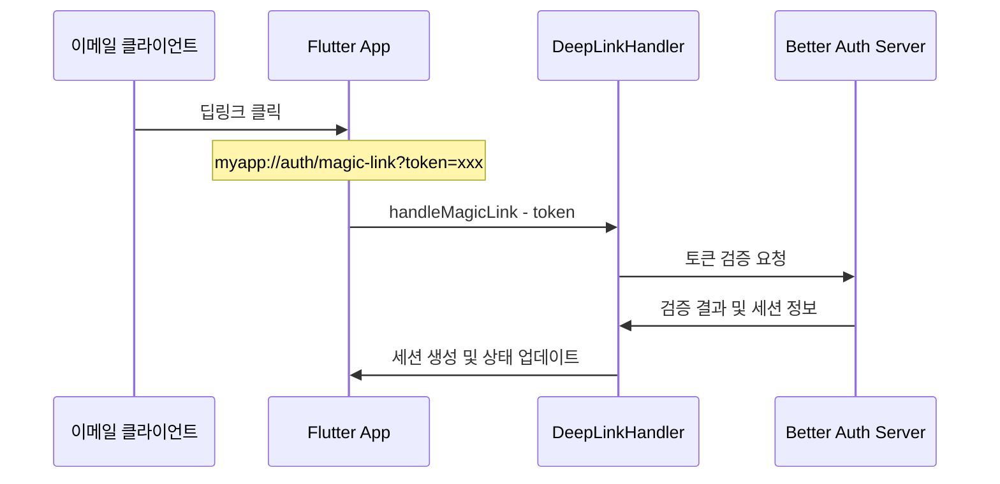

### 4.6 Passkey API

**패스키 등록:**

```
passkey.register(
  name: String?,             // 패스키 이름 (선택)
) → Future<PasskeyCredential>
```

**패스키 인증:**

```
passkey.authenticate() → Future<AuthResponse<Session>>
```

**플랫폼별 구현:**

| 플랫폼  | 네이티브 API                                                |
| ------- | ----------------------------------------------------------- |
| Android | Credential Manager API (Android 14+), FIDO2 API (이전 버전) |
| iOS     | ASAuthorization (iOS 16+)                                   |

### 4.7 Organization API

**조직 생성:**

```
organization.create(
  name: String,
  slug: String?,
  logo: String?,
  metadata: Map<String, dynamic>?,
) → Future<Organization>
```

**멤버 초대:**

```
organization.inviteMember(
  email: String,
  role: String,              // "owner", "admin", "member"
  teamId: String?,
) → Future<Invitation>
```

**역할 기반 접근 제어 (Permission Matrix):**

| Resource   | Action | owner | admin | member |
| ---------- | ------ | :---: | :---: | :----: |
| org        | update |   ✓   |   ✓   |   ✗    |
| org        | delete |   ✓   |   ✗   |   ✗    |
| member     | create |   ✓   |   ✓   |   ✗    |
| member     | update |   ✓   |   ✓   |   ✗    |
| member     | delete |   ✓   |   ✓   |   ✗    |
| invitation | create |   ✓   |   ✓   |   ✗    |
| invitation | cancel |   ✓   |   ✓   |   ✗    |

---

## 5. 데이터 모델 및 타입 시스템

### 5.1 User & Session 모델

**User:**

```
User:
  - id: String
  - email: String
  - name: String
  - image: String?
  - emailVerified: bool
  - createdAt: DateTime
  - updatedAt: DateTime
```

**Session:**

```
Session:
  - id: String
  - userId: String
  - token: String
  - expiresAt: DateTime
  - createdAt: DateTime
  - updatedAt: DateTime
  - ipAddress: String?
  - userAgent: String?
```

### 5.2 Organization 모델

**Organization:**

```
Organization:
  - id: String
  - name: String
  - slug: String
  - logo: String?
  - metadata: Map<String, dynamic>?
  - createdAt: DateTime
```

**Member:**

```
Member:
  - id: String
  - userId: String
  - organizationId: String
  - role: String | List<String>
  - teamId: String?
  - createdAt: DateTime
```

**Invitation:**

```
Invitation:
  - id: String
  - email: String
  - role: String
  - organizationId: String
  - status: InvitationStatus  // pending, accepted, rejected, expired
  - expiresAt: DateTime
```

### 5.3 Request/Response DTO 정의

**AuthResponse<T>:**

```
AuthResponse<T>:
  - data: T?
  - error: BetterAuthError?

사용 예:
  AuthResponse<User>     // 회원가입 응답
  AuthResponse<Session>  // 로그인 응답
```

**PaginatedResponse<T>:**

```
PaginatedResponse<T>:
  - data: List<T>
  - total: int
  - page: int
  - pageSize: int
  - hasMore: bool
```

### 5.4 에러 핸들링 및 예외 클래스

**예외 계층 구조:**

```
BetterAuthException (Base)
    │
    ├── NetworkException
    │   ├── TimeoutException
    │   ├── NoInternetException
    │   └── ServerException
    │
    ├── UserCancelledException            // 사용자가 작업 취소 (UI에서 조용히 처리)
    │   ├── OAuthCancelledException       // OAuth 로그인 취소
    │   ├── PasskeyCancelledException     // Passkey 인증 취소
    │   └── BiometricCancelledException   // 생체 인증 취소
    │
    ├── AuthException
    │   ├── InvalidCredentialsException
    │   ├── UserAlreadyExistsException
    │   ├── EmailNotVerifiedException
    │   ├── SessionExpiredException
    │   └── TwoFactorRequiredException
    │
    ├── OAuthException
    │   ├── OAuthFailedException
    │   └── ProviderNotConfiguredException
    │
    ├── PasskeyException
    │   ├── PasskeyNotSupportedException  // 플랫폼 미지원
    │   ├── PasskeyNotRegisteredException // 등록된 패스키 없음
    │   └── PasskeyFailedException        // 인증 실패
    │
    ├── OrganizationException
    │   ├── NotMemberException
    │   ├── InsufficientPermissionException
    │   └── InvitationExpiredException
    │
    └── ValidationException
        ├── InvalidEmailException
        ├── WeakPasswordException
        └── RequiredFieldException
```

**UserCancelledException 사용 가이드:**

```
UserCancelledException은 사용자가 의도적으로 작업을 취소한 경우 발생합니다.
이 예외는 일반적으로 UI에서 무시하거나 조용히 처리해야 합니다.

예시:
try {
  await authClient.signIn.social(provider: "google");
} on UserCancelledException {
  // 사용자가 취소함 - 아무것도 하지 않음 (토스트/스낵바 불필요)
  return;
} on OAuthFailedException catch (e) {
  // 실제 오류 - 사용자에게 알림
  showErrorSnackbar(e.message);
}
```

**에러 코드 매핑:**

| 서버 에러 코드            | Dart Exception                  |
| ------------------------- | ------------------------------- |
| INVALID_EMAIL_OR_PASSWORD | InvalidCredentialsException     |
| USER_ALREADY_EXISTS       | UserAlreadyExistsException      |
| EMAIL_NOT_VERIFIED        | EmailNotVerifiedException       |
| SESSION_EXPIRED           | SessionExpiredException         |
| TWO_FACTOR_REQUIRED       | TwoFactorRequiredException      |
| INVALID_TOTP_CODE         | InvalidTOTPCodeException        |
| PERMISSION_DENIED         | InsufficientPermissionException |

---

## 6. 보안 설계

### 6.1 토큰 저장소 (Secure Storage) 구현

**저장소 인터페이스:**

```
TokenStorage:
  + read(key: String) → Future<String?>
  + write(key: String, value: String) → Future<void>
  + delete(key: String) → Future<void>
  + deleteAll() → Future<void>
```

**플랫폼별 구현:**

| 플랫폼  | 저장소                     | 암호화         |
| ------- | -------------------------- | -------------- |
| Android | EncryptedSharedPreferences | AES-256 (Tink) |
| iOS     | Keychain                   | Secure Enclave |

**저장 데이터:**

```
Keys:
  - better_auth_session_token     // 세션 토큰
  - better_auth_refresh_token     // 리프레시 토큰 (있는 경우)
  - better_auth_user_id           // 사용자 ID (캐싱)
```

### 6.2 네트워크 보안

**HTTPS 강제:**

- 모든 API 호출은 HTTPS만 허용
- HTTP URL 입력 시 경고 또는 에러

**Certificate Pinning (선택적):**

```
ClientOptions(
  certificatePinning: [
    "sha256/AAAAAAAAAAAAAAAAAAAAAAAAAAAAAAAAAAAAAAAAAAA=",
  ],
)
```

**요청 서명 (선택적):**

- 민감한 요청에 타임스탬프 + HMAC 서명 추가 옵션

### 6.3 생체 인증 연동

**Passkey 생체 인증:**

```
Passkey 등록/인증 시 플랫폼 생체 인증 자동 트리거:
  - Android: Fingerprint, Face Unlock
  - iOS: Face ID, Touch ID
```

**로컬 인증 (선택적):**

```
앱 잠금 해제 시 local_auth 패키지 연동 가능:
  - 세션 토큰 접근 전 생체 인증 요구
  - 민감한 작업 전 재인증
```

---

## 7. 플랫폼별 구현 상세

### 7.1 Android

**최소 요구사항:**

- minSdkVersion: 21 (Android 5.0)
- targetSdkVersion: 34 (Android 14)

**Passkey 구현:**

```
Android 14+: Credential Manager API
Android 10-13: FIDO2 API (Google Play Services)
Android 9 이하: 지원 불가 (graceful degradation)
```

**딥링크 설정:**

```xml
<!-- AndroidManifest.xml -->
<intent-filter android:autoVerify="true">
    <action android:name="android.intent.action.VIEW" />
    <category android:name="android.intent.category.DEFAULT" />
    <category android:name="android.intent.category.BROWSABLE" />
    <data
        android:scheme="https"
        android:host="example.com"
        android:pathPrefix="/auth/callback" />
</intent-filter>
```

**ProGuard 규칙:**

```
-keep class com.example.better_auth_flutter.** { *; }
```

### 7.2 iOS

**최소 요구사항:**

- iOS 12.0+
- Passkey: iOS 16.0+

**Passkey 구현:**

```
iOS 16+: ASAuthorization API
iOS 15 이하: 지원 불가
```

**Universal Link 설정:**

```
Associated Domains capability:
  applinks:example.com
```

**Info.plist:**

```xml
<key>CFBundleURLTypes</key>
<array>
    <dict>
        <key>CFBundleURLSchemes</key>
        <array>
            <string>myapp</string>
        </array>
    </dict>
</array>
```

---

## 8. 테스트 및 배포 전략

### 8.1 유닛 테스트

**테스트 범위:**

- 모든 API 메서드
- 에러 핸들링
- 상태 전환
- 플러그인 등록/해제

**Mocking 전략:**

```
MockHttpClient: HTTP 응답 모킹
MockStorage: 토큰 저장소 모킹
MockDeepLinkHandler: 딥링크 모킹
```

### 8.2 통합 테스트

**E2E 테스트:**

- 실제 Better Auth 서버 연동
- 전체 인증 플로우 테스트
- 딥링크 처리 테스트

**테스트 환경:**

```
Docker Compose로 Better Auth 서버 구성
테스트용 OAuth 프로바이더 (Mock)
```

### 8.3 예제 앱 (Example App) 구성

**포함 기능:**

- 이메일/비밀번호 로그인/회원가입
- Google 로그인 (OAuth)
- 2FA 설정 및 사용
- 조직 생성 및 관리
- Riverpod 상태관리 예제
- 딥링크 처리 및 GoRouter 연동

**디렉토리 구조:**

```
example/
├── lib/
│   ├── main.dart
│   ├── router/
│   │   └── app_router.dart           # GoRouter 설정 및 딥링크 처리
│   ├── providers/
│   │   └── auth_provider.dart
│   ├── screens/
│   │   ├── login_screen.dart
│   │   ├── signup_screen.dart
│   │   ├── home_screen.dart
│   │   ├── two_factor_screen.dart
│   │   ├── organization_screen.dart
│   │   └── auth_callback_screen.dart # OAuth/MagicLink 콜백 처리
│   └── widgets/
│       └── ...
├── android/
│   └── app/src/main/AndroidManifest.xml  # 딥링크 intent-filter 예시
├── ios/
│   └── Runner/Info.plist                 # URL Scheme 및 Universal Link 예시
└── README.md
```

**GoRouter 딥링크 연동 예시:**

**Route 설정:**

| Route                  | 용도                   | Query Params           |
| ---------------------- | ---------------------- | ---------------------- |
| `/auth/callback`       | OAuth 콜백 처리        | token, provider, error |
| `/auth/magic-link`     | Magic Link 토큰 처리   | token                  |
| `/auth/verify-email`   | 이메일 인증 처리       | token                  |
| `/auth/reset-password` | 비밀번호 재설정 페이지 | token                  |

**AuthCallbackScreen 동작 흐름:**

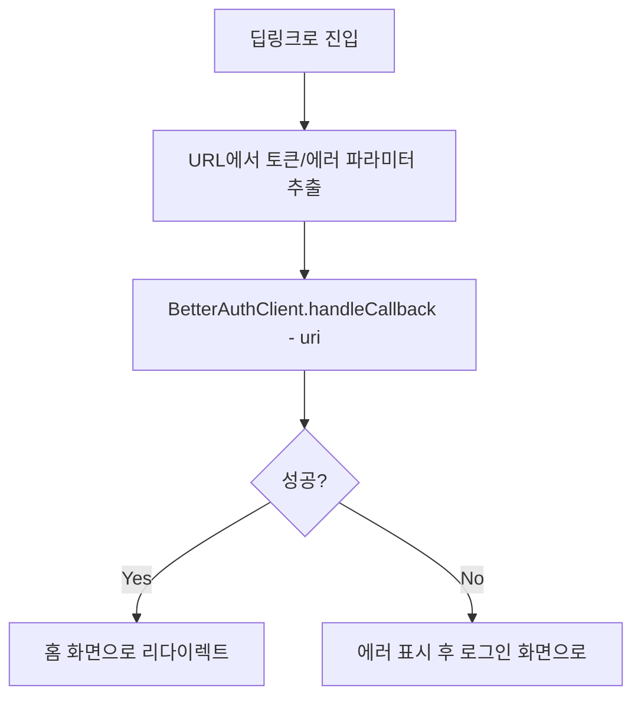

**플랫폼별 딥링크 설정 예시:**

| 플랫폼  | 파일                | 설정 내용                            |
| ------- | ------------------- | ------------------------------------ |
| Android | AndroidManifest.xml | `<intent-filter>` with scheme/host   |
| iOS     | Info.plist          | CFBundleURLTypes, Associated Domains |

예제 앱 README에 플랫폼별 딥링크 설정 가이드 포함

---

## 9. 패키지 구조

### 9.1 패키지 분리

| 패키지                         | 설명                  | 의존성                                 |
| ------------------------------ | --------------------- | -------------------------------------- |
| `better_auth_flutter`          | Core SDK              | Flutter, dio, flutter_secure_storage   |
| `better_auth_flutter_riverpod` | Riverpod 래퍼         | better_auth_flutter, flutter_riverpod  |
| `better_auth_flutter_passkey`  | Passkey 네이티브 구현 | better_auth_flutter, platform channels |

### 9.2 버전 관리

```
better_auth_flutter: ^1.0.0
better_auth_flutter_riverpod: ^1.0.0
better_auth_flutter_passkey: ^1.0.0
```

Better Auth 서버 버전과 호환성 매트릭스 유지

---

## 10. 참조

### 10.1 Better Auth 공식 문서

- 공식 사이트: https://www.better-auth.com/
- GitHub: https://github.com/better-auth/better-auth
- 클라이언트 문서: https://www.better-auth.com/docs/concepts/client
- 플러그인 문서: https://www.better-auth.com/docs/concepts/plugins

### 10.2 Flutter/Dart 참조

- Flutter 공식: https://flutter.dev/
- flutter_secure_storage: https://pub.dev/packages/flutter_secure_storage
- Riverpod: https://riverpod.dev/
- Dio: https://pub.dev/packages/dio

### 10.3 인증 표준

- OAuth 2.0: https://oauth.net/2/
- OpenID Connect: https://openid.net/connect/
- WebAuthn: https://webauthn.io/
- FIDO2: https://fidoalliance.org/fido2/

### 10.4 플랫폼 API

- Android Credential Manager: https://developer.android.com/identity/sign-in/credential-manager
- iOS ASAuthorization: https://developer.apple.com/documentation/authenticationservices
