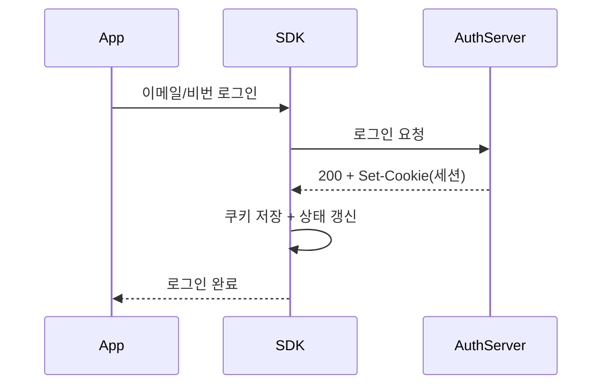
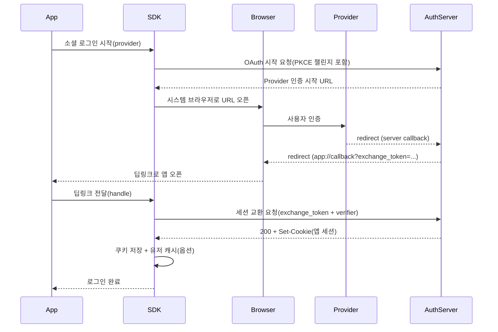
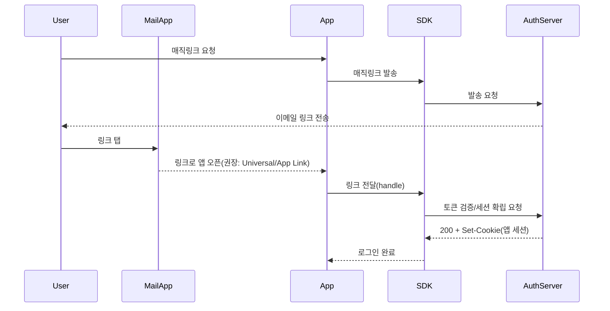
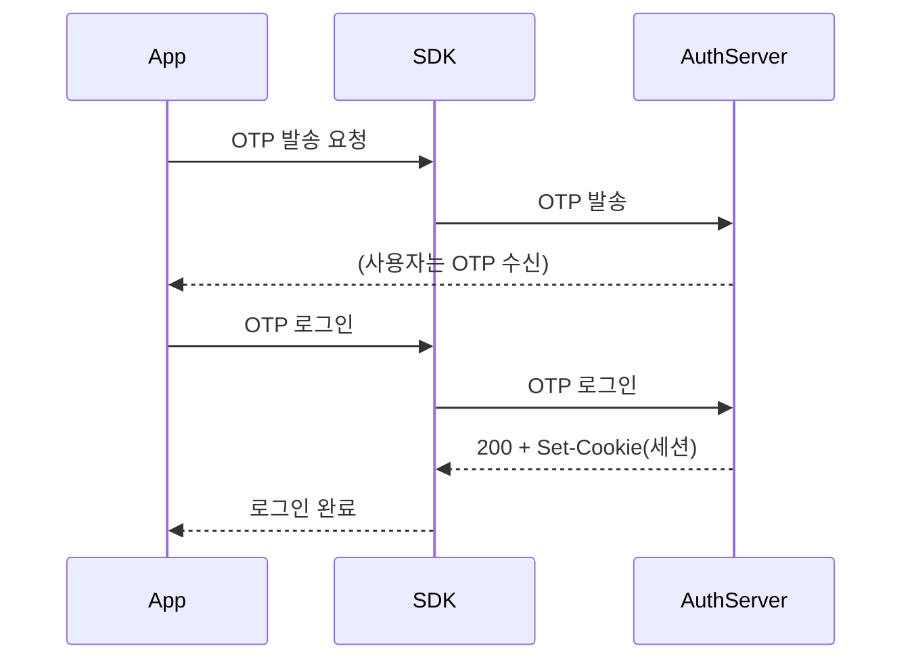
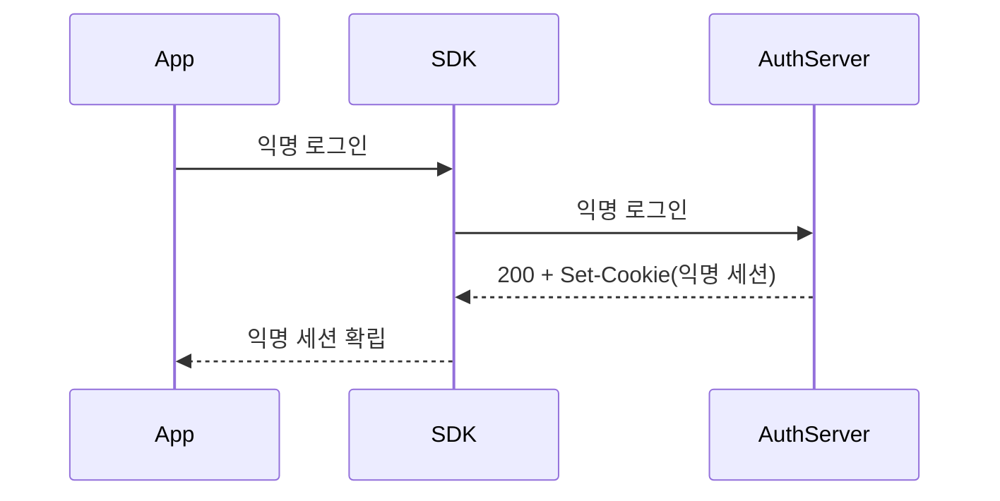
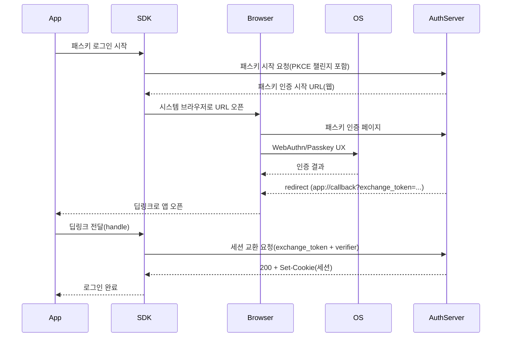

# better-auth-flutter PRD (v0.0.1)

- 작성일: 2026-01-15
- 저장 위치: `docs/better-auth-flutter-prd.md`

## 1. 개요

### 1.1 배경
- Better Auth는 TypeScript 기반의 범용 인증/인가 프레임워크이며, 기본 세션 모델은 쿠키 기반 세션이다.
- Better Auth는 Expo 통합(`@better-auth/expo`)을 통해 모바일에서 딥링크/쿠키 저장/소셜 로그인 UX를 보조한다.
- Flutter(iOS/Android) 환경에서는 동등한 “모바일 클라이언트 계층”이 부재하여, Better Auth 서버를 그대로 사용하면서도 모바일 인증 플로우를 완주하기 어렵다.

### 1.2 문제 정의
- **브라우저 쿠키와 앱 쿠키의 분리(Cookie Isolation)**: 시스템 브라우저에서 설정된 쿠키는 Flutter 앱의 HTTP 클라이언트가 직접 읽을 수 없다.
- **딥링크 설정 실패가 곧 로그인 실패**: OAuth/매직링크/패스키는 딥링크(커스텀 스킴/앱링크/유니버설링크) 설정이 누락되면 복귀 자체가 불가능하다.
- **앱 UI와 인증 상태 동기화**: 앱은 로그인/로그아웃/세션만료 등의 변화를 즉시 반영해야 하므로 reactive한 인증 상태 노출이 필수다.

### 1.3 목표
- Better Auth 서버(기존 TypeScript 서버)는 그대로 유지하고, Flutter용 클라이언트 SDK를 제공한다.
- v0.0.1에서 아래 기능을 “모바일 환경에서 끝까지 동작”하도록 표준 플로우를 정의한다.
  - 이메일+비밀번호
  - 이메일 매직링크
  - 이메일 OTP
  - 소셜 OAuth(시스템 브라우저 기반)
  - 패스키(서버의 passkey 플러그인과 호환되는 **모바일 완주 플로우**)
  - 익명/게스트(anonymous 플러그인 호환)
- Secure Storage 기반 세션 지속성 + 인증 상태 스트림 제공으로 앱 개발 난이도를 낮춘다.

### 1.4 비목표(Non-Goals)
- Better Auth 서버 자체를 Dart/Flutter로 포팅하지 않는다.
- Flutter Web/Desktop 지원은 범위에서 제외한다.
- OAuth 제공자별 콘솔 설정(예: Google Console)은 범위에서 제외하고 공식 문서 링크로 대체한다.

## 2. 범위 및 가정

### 2.1 지원 플랫폼
- Flutter iOS/Android

### 2.2 서버 가정(필수)
- Better Auth의 기본 엔드포인트/세션 방식을 사용한다(기본 `basePath`는 `/api/auth`).
- 서버는 모바일 딥링크 스킴/유니버설링크 도메인을 `trustedOrigins`에 등록할 수 있다.
- 서버는 `socialProviders.*.redirectURI`(OAuth 콜백 URL)를 설정할 수 있으며, 기본은 Auth Server의 콜백 엔드포인트(https)를 사용한다.
- 인증 완료 후 앱으로 복귀시키기 위해, Auth Server는 앱 딥링크를 리다이렉트 목적지로 사용할 수 있어야 하며(예: `callbackURL`), 해당 딥링크는 `trustedOrigins`에 등록되어야 한다.

### 2.3 용어
- **Auth Server**: Better Auth가 구동되는 서버
- **Client SDK**: Flutter/Dart 패키지(본 프로젝트)
- **Session Cookie**: Better Auth 세션 식별 쿠키(서버가 발급)
- **Callback Deep Link**: 인증 완료 후 앱으로 복귀시키는 링크
- **Session Exchange**: 앱이 딥링크로 받은 값(code/token 등)을 이용해 서버로부터 **앱이 보관할 수 있는 세션 쿠키를 재발급/확립**하는 과정

## 3. 핵심 사용자 시나리오

- S1: 사용자가 이메일/비밀번호로 로그인하고 앱 재실행 후에도 로그인 상태가 유지된다.
- S2: 사용자가 소셜 로그인(시스템 브라우저) 완료 후 앱으로 복귀하면 세션이 확립된다.
- S3: 사용자가 이메일 매직링크를 탭하면 앱이 열리고 세션이 확립된다.
- S4: 사용자가 OTP를 입력해 로그인하고 세션이 확립된다.
- S5: 사용자가 “게스트로 시작(익명 로그인)” 후, 계정 연결을 통해 정식 계정으로 전환한다.
- S6: 사용자가 “패스키로 로그인”을 선택하면, 안전한 외부 사용자 에이전트 기반 UX로 인증을 완료하고 앱 세션이 확립된다.

## 4. 설계 원칙(Architecture Principles)

- **외부 사용자 에이전트 원칙**: OAuth는 WebView가 아니라 시스템 브라우저/브라우저 탭을 사용한다(RFC 8252).
- **세션은 앱이 보관 가능해야 한다**: 브라우저 쿠키에만 의존하지 않고, 앱이 HTTP 요청에서 재현 가능한 형태로 세션을 확보한다(Session Exchange).
- **최소 노출**: 세션/장기 토큰을 URL 쿼리로 직접 노출하지 않고, 필요한 경우에도 일회성 값만 전달한다.
- **Reactive First**: 인증 상태는 스트림/리스너 형태로 노출되어 UI가 쉽게 구독한다.

## 5. 고수준 아키텍처(개념)

- **AuthClient**: Better Auth 엔드포인트 호출 추상화
- **NetworkLayer**: 요청/응답 인터셉트, 쿠키 처리, (필요 시) 헤더 주입
- **SessionManager**: 현재 세션 상태 유지/복원/폐기, 유저 정보 캐싱
- **CookieStore**: `Set-Cookie` 수신 → 저장 → 요청 시 `Cookie` 헤더 구성
- **SecureStorageAdapter**: OS 보안 저장소 기반(기본: `flutter_secure_storage`)
- **DeepLinkRouter**: 앱으로 유입된 딥링크를 SDK로 전달/검증
- **OAuthBrowserController**: 시스템 브라우저 기반 인증 화면 호출 및 사용자 취소 표준화

## 6. 기능 요구사항

### 6.1 이메일+비밀번호
- 회원가입/로그인/로그아웃
- 서버가 발급한 세션 쿠키를 저장하고 이후 요청에 자동 포함

### 6.2 매직링크
- 서버의 magic-link 플러그인을 전제로 한다.
- 사용자가 메일 앱에서 링크를 탭하면 앱이 열리고, SDK가 링크를 처리해 세션을 확립한다.
- 링크 만료/오류 시 에러를 세분화한다(만료/이미 사용됨/서버 오류/네트워크 오류).

### 6.3 이메일 OTP
- 서버의 email-otp 플러그인을 전제로 한다.
- OTP 요청/검증/로그인까지의 호출 흐름을 SDK가 제공한다.

### 6.4 소셜 OAuth (시스템 브라우저)
- 시스템 브라우저(또는 OS가 제공하는 브라우저 탭)로 인증을 진행한다.
- 인증 완료 후 앱으로 복귀하면 SDK가 Session Exchange를 수행해 앱 세션을 확립한다.
- 사용자 취소/중단/네트워크 장애를 에러 모델로 분리한다.

### 6.5 패스키
- 서버의 passkey 플러그인을 전제로 한다.
- v0.0.1에서는 **브라우저(WebAuthn) 기반 패스키 사용자 플로우**를 우선 정의한다.
  - 전제: 패스키 등록/인증을 수행하는 화면은 외부 사용자 에이전트(브라우저)에서 수행 가능해야 한다.
  - 완료 후 앱으로 복귀하면 Session Exchange로 앱 세션을 확립한다.
- 네이티브 Passkey(플랫폼 API 직접 호출)는 후속 버전 범위로 둔다.

### 6.6 익명/게스트
- 서버의 anonymous 플러그인을 전제로 한다.
- 익명 세션 발급 및 추후 계정 연결 시나리오를 지원한다.

### 6.7 Session Exchange 메커니즘(핵심)

#### 요구사항
- 브라우저에서 완료된 인증 결과를 **앱이 보관 가능한 세션(쿠키/토큰)**으로 전환하는 단계를 반드시 제공한다.
- “브라우저가 가진 쿠키를 앱이 가져오는 방식”은 불가능하므로 금지한다.

#### 표준 접근(권장: Server Callback → App Deep Link → Session Exchange)
- OAuth Provider 콘솔에는 “Auth Server의 콜백 URL(https)”을 등록한다(일반적으로 Provider가 커스텀 스킴을 허용하지 않는 경우가 있어, 서버 콜백을 표준으로 둔다).
- 앱은 SDK를 통해 Auth Server에 OAuth 시작 요청을 보낸다. Auth Server는 Provider 인증 시작 URL을 반환한다.
- 사용자는 시스템 브라우저에서 인증을 완료한다. Provider는 Auth Server 콜백으로 리다이렉트한다.
- Auth Server는 OAuth 처리를 완료한 뒤, 앱 딥링크로 리다이렉트하며 **일회성 세션 교환 토큰(`exchange_token`)**을 포함한다.
- 앱은 딥링크로 받은 `exchange_token`을 SDK에 전달하고, SDK는 Auth Server에 “세션 교환 요청”을 보내 `Set-Cookie`를 수신·저장한다.
- `exchange_token`은 딥링크 탈취 위험을 고려하여 **Proof-of-Possession**으로 보호되어야 한다(권장: PKCE 원칙 준용, RFC 7636).

#### 예외/대안
- Provider가 커스텀 스킴/유니버설링크 리다이렉트를 지원하고, 서버/보안 정책이 허용하는 경우 “Provider → App 직접 복귀” 패턴을 추가로 지원할 수 있다.
- 어떤 패턴이든 최종적으로는 앱이 `Set-Cookie`를 확인할 수 있는 HTTP 응답을 한 번은 받아야 한다(브라우저 쿠키를 복사하는 방식은 불가능).

## 7. 비기능 요구사항

### 7.1 세션/쿠키 관리(핵심)
- 서버 응답의 `Set-Cookie` 헤더에서 **Better Auth 관련 쿠키만** 식별해 저장한다(기본 prefix는 `better-auth`).
- 앱 시작 시 Secure Storage에서 쿠키를 읽어 메모리로 로드하고, 요청마다 `Cookie` 헤더를 구성한다.
- 로그아웃 시 저장된 쿠키/캐시된 세션 정보를 폐기한다.
- “앱 재실행 즉시 UI 반영”을 위해 마지막으로 확인된 **유저/세션 데이터 캐시**를 옵션으로 제공한다(캐시의 신뢰도/만료 정책 포함).

### 7.2 네트워크/헤더 호환성
- 서버 설정에 따라 `Origin` 검증/CSRF 보호가 활성화될 수 있으므로,
  - SDK는 필요 시 `Origin` 등 특정 헤더를 주입할 수 있는 확장 지점을 제공한다.
  - 서버 측에서 `trustedOrigins` 설정을 통해 앱 스킴/도메인을 허용해야 한다.
- 보안 강도를 위해 서버에서 `disableCSRFCheck` 같은 전역 비활성화 옵션을 요구하지 않는다(문서로 리스크 안내).

### 7.3 딥링크/유니버설링크
- Android App Links 및 iOS Universal Links 설정을 PRD 범위에 포함한다.
- Cold start / Warm start 모두에서 동일하게 딥링크가 SDK로 전달되어야 한다.
- “초기 링크(앱을 연 첫 URL)”를 반드시 확인하고 처리하는 절차를 문서화한다.

### 7.4 에러 모델
- Better Auth 표준 에러 코드(서버)와 모바일 특화 에러를 분리한다.
  - 모바일 특화 예: 사용자 취소, 딥링크 미설정, 딥링크 유실(초기 URL 미처리), 보안 저장소 접근 실패

### 7.5 보안
- OAuth 인증 요청은 외부 사용자 에이전트(시스템 브라우저)를 사용한다(RFC 8252).
- 임베디드 WebView 기반 로그인은 지원하지 않는다.
- 딥링크에는 가능한 한 **일회성 값**만 포함하고, 세션 확립은 서버 응답(`Set-Cookie`)으로 수행한다.
- `exchange_token`은 재사용 불가(one-time)여야 하며, 딥링크 가로채기 리스크를 고려해 Proof-of-Possession(권장: PKCE 원칙 준용, RFC 7636)으로 보호되어야 한다.

## 8. SDK API 표면(코드 없이)

### 8.1 초기화
- base URL
- auth path(기본 `/api/auth`)
- 딥링크 구성(스킴/호스트/경로 패턴)
- cookie prefix(단일 또는 복수) 및 저장 대상 쿠키 필터
- Secure Storage 어댑터(기본: `flutter_secure_storage`)

### 8.2 인증 API
- 이메일/비밀번호, OTP, 매직링크, 소셜 OAuth, 패스키, 익명 로그인

### 8.3 세션 API
- 현재 세션 조회
- 인증 상태 스트림(인증됨/인증안됨/인증중/오류)
- 로그아웃

### 8.4 딥링크 처리 API
- 외부에서 들어온 URL을 SDK에 전달하는 단일 진입점(인증 콜백 판별 + 처리 결과 반환)

## 9. 인증 플로우(시퀀스)

### 9.1 Email/Password

### 9.2 Social OAuth (System Browser + Session Exchange)

### 9.3 Magic Link (App Link/Universal Link 선호)

### 9.4 Email OTP

### 9.5 Anonymous

### 9.6 Passkey (브라우저 기반 v0.0.1)

## 10. 딥링크/리다이렉트 설계

- 3가지 진입점을 정의한다.
  - (A) 커스텀 스킴: 개발/테스트 및 fallback
  - (B) Android App Links: 운영 환경 권장
  - (C) iOS Universal Links: 운영 환경 권장
- 앱이 수신한 URL은 앱 라우터가 소비하기 전에 SDK로 먼저 전달되어야 한다(인증 콜백 판별).
- 초기 링크(Cold start)를 처리하지 못하면 OAuth/매직링크/패스키가 간헐적으로 실패할 수 있으므로, 초기 URL 처리 절차를 문서에 포함한다.

## 11. 보안 고려사항

- OAuth는 외부 사용자 에이전트(시스템 브라우저)를 사용한다(RFC 8252).
- WebView 기반 로그인은 미지원.
- `trustedOrigins`는 앱 스킴/도메인을 명시적으로 허용하도록 가이드한다(무차별 wildcard 금지).
- 서버의 CSRF/Origin 보호를 무력화하는 설정(`advanced.disableCSRFCheck`, `advanced.disableOriginCheck`)은 **호환성 확보를 위한 요구사항(서버에서 설정 가능해야 함)** 으로 포함하되, 운영 적용은 보안 리뷰를 전제로 제한한다.

## 12. 호환성/버전 정책

- 패키지 버전은 SemVer를 따른다.
- Better Auth 서버의 엔드포인트/쿠키 변화에 민감하므로, “지원하는 Better Auth 최소 버전”을 문서화 시 확정한다.

## 13. 문서화 산출물

- Quickstart: 서버 준비 조건, 앱 딥링크 설정, SDK 초기화, 기본 로그인
- Cookbook: 인증 방식별 “성공까지 필요한 단계” 요약
- Troubleshooting: 자주 발생하는 오류(state mismatch, deep link 미수신, cookie 미저장, 초기 링크 미처리)

## 14. 추가 조사 결과(리스크 해소)

### 14.1 `trustedOrigins` 및 서버 보호 정책(Origin/CSRF/Fetch Metadata)
- Better Auth는 `trustedOrigins`로 허용할 origin(또는 커스텀 스킴)을 정의한다.
  - 정적 배열/동적 함수 지원, 와일드카드 패턴 지원.
  - 커스텀 스킴(예: `myapp://`)도 패턴으로 허용 가능.
- Better Auth는 보안상 다음 “전역 비활성화” 옵션을 제공한다.
  - `advanced.disableCSRFCheck`: Origin 검증/Fetch Metadata 기반 CSRF 보호 비활성화(보안 리스크).
  - `advanced.disableOriginCheck`: `callbackURL`, `redirectTo` 등 리다이렉트 URL 검증 비활성화(보안 리스크).
- 요구사항: Auth Server는 위 옵션을 **설정 가능(토글 가능)** 해야 하며, Flutter 앱 연동 과정에서 필요 시 활성화할 수 있어야 한다.
- 보안 주의: 운영(프로덕션)에서 활성화 시 CSRF/오픈 리다이렉트 리스크가 증가하므로, 운영 적용 전 보안 리뷰 및 범위 제한(예: 개발/스테이징 한정)을 문서로 강제한다.
- 결론: Flutter SDK는 기본적으로 `trustedOrigins` 기반의 정상 설정을 우선하며, 위 옵션은 “호환성 확보를 위한 최후 수단”으로 취급한다.
- 근거(공식): Better Auth Options 문서.
  - https://better-auth.com/llms.txt/docs/reference/options.md

### 14.2 “서버 콜백 → 앱 딥링크”에서 `exchange_token` 표준 방식 존재 여부
- Better Auth 문서에서 Flutter/네이티브 모바일을 위한 범용 `exchange_token`(명칭 고정) 표준 엔드포인트는 확인되지 않았다.
- 단, Better Auth는 OAuth 플로우에서 `callbackURL`을 지원하며, 인증 이후 해당 URL로 리다이렉트하는 구조를 제공한다.
- 결론: Flutter SDK의 “Session Exchange”를 안정적으로 만들기 위해서는,
  - (A) Better Auth Expo 통합과 동등한 “쿠키/세션 전달 메커니즘”을 재현하거나,
  - (B) Auth Server에 커스텀 구현(플러그인/미들웨어/보조 엔드포인트)을 추가해 **일회성 세션 교환 토큰**을 발급/검증하고, 앱이 HTTP 응답에서 `Set-Cookie`를 수신하게 해야 한다.
- 근거(공식): Better Auth Expo 통합은 “딥링크 복귀 + SecureStore 기반 쿠키 관리”를 전제로 한다.
  - https://better-auth.com/llms.txt/docs/integrations/expo.md

### 14.3 PKCE(Proof Key for Code Exchange) 적용 범위 및 정합성
- RFC 8252는 네이티브 앱 OAuth에서 외부 사용자 에이전트(브라우저) 사용을 권고하며, public native app client는 PKCE를 사용해야 함을 명시한다.
- 결론: 본 PRD는 `exchange_token`을 단독(단순 bearer)으로 쓰지 않고, PKCE 원칙 준용(또는 동등한 Proof-of-Possession)으로 보호하도록 정의한다.
- 근거(공식):
  - https://www.rfc-editor.org/rfc/rfc8252
  - https://www.rfc-editor.org/rfc/rfc7636

### 14.4 OAuth 제공자 리다이렉트/콜백 제약(실무 결론)
- 제공자별 정책은 상이하지만, 공통적으로 “서버 콜백은 https”를 요구하는 경우가 많다.
- 결론(실무 권장):
  - Provider 콘솔에는 “Auth Server 콜백 URL(https)”를 등록한다.
  - 앱 복귀는 Auth Server가 최종적으로 “App Links/Universal Links 또는 커스텀 스킴”으로 리다이렉트한다.
  - 커스텀 스킴은 개발/테스트 fallback으로 두고, 운영은 App Links/Universal Links를 권장한다(RFC 8252의 ‘claimed https’ 선호와 일치).
- 근거(공식): RFC 8252 리다이렉트 옵션.
  - https://www.rfc-editor.org/rfc/rfc8252

### 14.5 플러그인(매직링크/OTP/패스키)에서 “앱이 서버에 검증 요청 → Set-Cookie로 세션 확립” 가능성
- Magic Link는 verify 엔드포인트를 제공하며, 클라이언트가 토큰을 전달해 검증할 수 있다.
  - https://better-auth.com/llms.txt/docs/plugins/magic-link.md
- Email OTP는 OTP 발송/검증/로그인 관련 엔드포인트를 제공한다.
  - https://better-auth.com/llms.txt/docs/plugins/email-otp.md
- Passkey는 기본적으로 WebAuthn(브라우저/플랫폼 연동)을 전제하며, 플로우 중 challenge 쿠키를 사용한다.
  - https://better-auth.com/llms.txt/docs/plugins/passkey.md
- 결론: OTP/매직링크는 앱에서 “검증 요청 → 세션 확립” 흐름을 구성하기 용이하다. Passkey는 v0.0.1에서 브라우저 기반을 전제로 하되, 최종 세션 확립은 Session Exchange로 통일한다.

### 14.6 쿠키 필터링 정책(`cookiePrefix`, passkey challenge cookie 등)
- Better Auth는 기본적으로 `${prefix}.${cookie_name}` 형태의 쿠키 프리픽스를 사용하며, `advanced.cookiePrefix`로 변경 가능하다.
  - https://better-auth.com/llms.txt/docs/concepts/cookies.md
- Passkey 플러그인은 challenge 쿠키(`webAuthnChallengeCookie`)를 사용하며, 기본값은 `better-auth-passkey`로 문서화되어 있다.
  - https://better-auth.com/llms.txt/docs/plugins/passkey.md
- 결론: Flutter SDK는 (1) 저장할 쿠키 프리픽스 목록을 설정 가능하게 하고, (2) passkey 등 플러그인이 사용하는 쿠키 이름/프리픽스 변경 시 함께 동기화하도록 문서화한다.

### 14.7 Android App Links / iOS Universal Links 실패 케이스(공식 근거 요약)
- Android App Links는 도메인 소유, `assetlinks.json` 호스팅, 앱 서명 SHA-256 지문 등의 조건을 만족해야 한다.
  - https://docs.flutter.dev/cookbook/navigation/set-up-app-links
- iOS Universal Links는 Associated Domains 설정과 `apple-app-site-association` 파일 호스팅이 필요하며, 리다이렉트(redirect)가 있으면 실패할 수 있다.
  - https://docs.flutter.dev/cookbook/navigation/set-up-universal-links
  - https://developer.apple.com/library/archive/documentation/General/Conceptual/AppSearch/UniversalLinks.html
- 결론: PRD에서 운영 권장 경로(App Links/Universal Links)와 개발 fallback(커스텀 스킴)을 명확히 구분하며, Troubleshooting에 “AASA/assetlinks 파일 경로/캐시/리다이렉트” 실패 유형을 포함한다.

## 15. 공식 문서 링크

### Better Auth
- Introduction: https://www.better-auth.com/docs/introduction
- LLMs.txt(전체 목차): https://better-auth.com/llms.txt
- Client: https://better-auth.com/llms.txt/docs/concepts/client.md
- Cookies: https://better-auth.com/llms.txt/docs/concepts/cookies.md
- Session Management: https://better-auth.com/llms.txt/docs/concepts/session-management.md
- OAuth: https://better-auth.com/llms.txt/docs/concepts/oauth.md
- Options(`trustedOrigins`, `basePath` 등): https://better-auth.com/llms.txt/docs/reference/options.md
- Magic Link plugin: https://better-auth.com/llms.txt/docs/plugins/magic-link.md
- Email OTP plugin: https://better-auth.com/llms.txt/docs/plugins/email-otp.md
- Anonymous plugin: https://better-auth.com/llms.txt/docs/plugins/anonymous.md
- Passkey plugin: https://better-auth.com/llms.txt/docs/plugins/passkey.md
- Bearer plugin(선택): https://better-auth.com/llms.txt/docs/plugins/bearer.md

### Flutter / Mobile
- Flutter Deep Linking: https://docs.flutter.dev/ui/navigation/deep-linking
- Flutter Cookbook Android App Links: https://docs.flutter.dev/cookbook/navigation/set-up-app-links
- Flutter Cookbook iOS Universal Links: https://docs.flutter.dev/cookbook/navigation/set-up-universal-links
- flutter_secure_storage: https://pub.dev/packages/flutter_secure_storage
- flutter_appauth: https://pub.dev/packages/flutter_appauth

### 표준/플랫폼
- RFC 8252 OAuth 2.0 for Native Apps: https://www.rfc-editor.org/rfc/rfc8252
- RFC 7636 Proof Key for Code Exchange (PKCE): https://www.rfc-editor.org/rfc/rfc7636
- Apple Documentation Archive(Universal Links): https://developer.apple.com/library/archive/documentation/General/Conceptual/AppSearch/UniversalLinks.html
